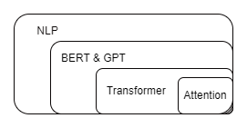

# Attention

Attention 机制很像人类看图片的逻辑，当我们看一张图片的时候，我们并没有看清图片的全部内容，而是将注意力集中在了图片的焦点上。 
Attention 分为空间注意力（用于CV领域）和时间注意力（用于NLP领域）。

+ 为什么要引入Attention:
  由Encoder生成的中间向量C的长度是固定的。当输入的原序列的长度比较长时，中间向量C无法保存全部的信息，

## Attention的优缺点

+ Attention的优点
+ Attention的缺点

