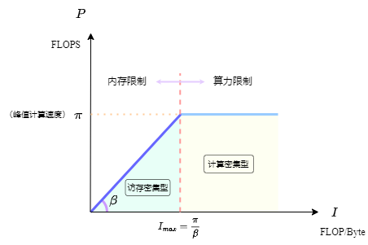

# 影响模型推理速度的因素

影响模型推理速度的因素主要有两个方面：一是模型本身；二是硬件计算平台。 模型和计算平台的适配程度综合决定了模型的实际表现（FPS）。

## 计算平台

### 算力 $\pi$

&emsp;&emsp;计算平台的算力，又称为计算平台的性能上限。通常用 [FLOPS](../EvaluationMetrics/FLOPS&FLOPs.md#FLOPS) or FLOP/s 来衡量。

### 带宽 $\beta$

&emsp;&emsp;计算平台的带宽上限：一个计算平台每秒钟最多能完成的数据内存交换量，计算单位为 Byte/s。

### 计算强度上限 $I_{max}$

&emsp;&emsp;计算平台上，单位内存交换进行计算的最多次数。（这里的“内存”包含CPU的内存、GPU的显存）

$$I_{max} = \frac{\pi}{\beta}$$

## 模型的性能评价指标

### 参数量 

&emsp;&emsp;参数量：参数的个数。

### 计算量 $F$

&emsp;&emsp;计算量：又称浮点运算量，表示网络进行前向传播时需要进行的加法和乘法操作的次数，即模型的时间复杂度，单位为 [FLOPs](../EvaluationMetrics/FLOPS&FLOPs.md#FLOPs)。

### 访存量 $B$

&emsp;&emsp;访存量：输入一个样本，模型进行一次前向传播（也就是进行一次推理）需要的内存交换总量（存储单元的字节大小），即模型的空间复杂度。 
&emsp;&emsp;在理想情况下，模型的访存量=模型各层权重参数的内存占用（Kernel Mem）+ 每层输出的特征图的内存占用（Output Mem）。单位为 Byte（or KB/MB/GB）。 
&emsp;&emsp;由于进行运算的数据类型通常为 float32，因此通常需要×4（一个float占用4个字节）。

### 模型的计算强度 $I$

&emsp;&emsp;模型的计算强度，又称计算密度。 
&emsp;&emsp;计算密度：模型在计算过程中，每Byte内存交换用于多少次浮点运算。单位为 FLOPs/Byte。

$$I=\frac{F}{B}$$

### 模型的理论性能 $P$

&emsp;&emsp;理论上，模型在计算平台上所能达到的每秒浮点运算次数。单位为 [FLOPS](../EvaluationMetrics/FLOPS&FLOPs.md#FLOPS) or FLOP/s。可以使用 [Roof-line Model](Roof-lineModel.md) 来衡量。

### 内存占用

&emsp;&emsp;内存占用：模型运行时所占用的内存/显存大小。一般需要关注的是最大内存占用。 
&emsp;&emsp;内存占用 $\neq$ 访存量。 
&emsp;&emsp;内存占用大小除了受模型本身影响外，还受软件实现的影响。例如，有的框架为了保证推理速度，会将模型中的每一个 Tensor 都提前分配好，因此内存占用为网络中所有 Tensor 大小的总和；有的框架提供 lite 内存模式，即动态为 Tensor 分配内存，以最大程度节省内存占用（当然，可能会牺牲一部分性能）。

