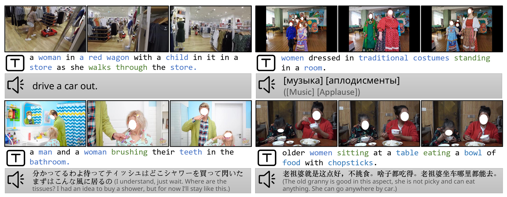

# InternVid: A Large-scale Video-Text Dataset for Multimodal Understanding and Generation

## Abstract

&emsp;本文介绍了以视频为中心的大规模多模态数据集 InternVid，该数据集可帮助学习功能强大且可迁移的视频-文本表征，从而实现多模态理解和生成。InternVid 数据集包含 700 多万个视频，持续时间近 76 万小时，产生了 2.34 亿个视频片段，并附有总计 4.1B 个单词的详细描述。我们的核心贡献是开发出一种可扩展的方法，利用大型语言模型（LLM）自主构建高质量的视频-文本数据集，从而展示其在大规模学习视频语言表征方面的功效。具体来说，我们利用多尺度方法生成与视频相关的描述。此外，我们还介绍了基于 ViT-L 的视频文本表征学习模型 ViCLIP。该模型通过对比学习在 InternVid 上学习，具有领先的 zero shot 动作识别能力和极具竞争力的视频检索性能。除了识别和检索等基本视频理解任务外，我们的数据集和模型还具有广泛的应用前景。它们尤其有利于生成交错视频-文本数据，用于学习以视频为中心的对话系统，推进视频-文本和文本-视频生成研究。这些建议的资源为对多模态视频理解和生成感兴趣的研究人员和从业人员提供了一种工具。

## Introduction

&emsp;在自动驾驶、智能监控、人机交互和视觉搜索等各种现实应用中，学习可迁移的视频-文本表征对于视频理解既具有挑战性，又至关重要。虽然利用网络规模数据进行多模态对比学习在图像-文本表征方面取得了成功，但在视频-语言领域的探索仍然不足。 
&emsp;造成这种探索有限的一个关键原因是缺乏用于大规模预训练的高质量视频语言数据集。目前的研究依赖于 HowTo100M [2]、HD-VILA [3] 和 YTTemporal [4, 5] 等数据集，这些数据集的文本是通过自动语音识别 (ASR) 生成的。尽管这些数据集规模庞大，但视频与相应文本描述之间的语义相关性往往很低[2-5]。实证研究表明，提高这种相关性（例如将视频与 caption 对齐以提高匹配度）对视频检索和视频问题解答等下游任务大有裨益[6]。最近的研究利用 WebVid10M [6]（一个具有更高质量字幕的数据集）来解决视频与文本相关性低的问题。然而，其有限的规模和动态性阻碍了其在当前数据和模型扩展研究中的使用。具体来说，该数据集仅提供了 1,000 万个视频-文本对，而且所描述的场景包含的动作或活动相对较少。 

图 1：示例（我们给出了每个视频片段的三帧画面）、相应生成的 caption 以及 InternVid 中的 ASR 转录。在字幕中，我们用蓝色标出名词，用绿色标出动词。使用 LLM [1] 将非英语文本翻译成英语。

 
&emsp;我们提出了一个以视频为中心的大规模数据集 InternVid，以应对在保持视频与文本高度对应的同时扩大视频语言建模的挑战。[图 1](#fig1) 给出了可视化示例。请注意，ASR 转录文稿几乎没有描述视频中的视觉元素，而生成的 caption 却有。该数据集包含高度相关的视频-文本对，其中有超过 700 万个视频，总时长达 76 万小时，产生了 2.34 亿个视频片段，并针对不同需求提供了各种子集。这些视频涵盖 16 个场景和大约 6000 个动作描述。为了提高视频与文本的匹配度，我们采用多尺度方法生成字幕。在粗尺度中，我们为每个视频的中间帧制作字幕，并将描述作为视频字幕。在精细尺度中，我们逐帧生成字幕，并用语言模型对其进行总结。 
&emsp;利用 InternVid，我们从数据角度扩展了对比学习中的视频语言转换器（ViT-L），其实验证明 InternVid 能够学习可扩展的视频文本模型。我们在模型中引入了视频遮蔽，以加快整个学习过程，同时又不影响其有效性。视频和文本编码器从具有相同规模的 CLIP 预训练模型中初始化。有了 InternVid，我们可以在数个epoch中学习视频-文本模型，实现令人印象深刻的zero shot性能。与以前的视频 CLIP 变体相比，我们提出的 ViCLIP 在性能上有显著提高，尤其是在zero shot设置中。 
&emsp;除了大规模视频语言对比预训练外，我们还发现它在生成交错视频文本数据以学习以视频为中心的对话系统（如 Flamingo [7, 8] ）和推进视频生成方面也很有效。由于文本注释片段是从视频中提取的，我们自然会根据采样位置收集片段及其相应的文本。这就产生了约 700 万个交错数据，适合作为以视频为中心的多轮对话进行指令调整。为了生成视频，我们对核心集进行了过滤，获得了 1800 万个视频片段。除了 WebVid-10M，InternVid 还能将基于稳定扩散的视频生成模型提升到新的高度。 
总之，我们的贡献有三个方面。
 - 我们推出了一个新的网络规模视频语言数据集 InternVid。该数据集旨在大规模推进与视频相关的多模态理解和生成，采用由 LLM 支持的多尺度视频字幕方法创建，确保以最少的人工干预获得高质量的视频-文本数据。InternVid 拥有 700 万个视频，总计对应 2.34 亿个带有自动生成字幕的视频片段。该数据集横跨 16 个场景和大约 6000 个动作，包含了整个数据集的计算特征（视频-文本相关性和视觉美感），并提供了不同的子集以满足不同的训练需求。
- 我们学习了一种新的视频语言模型 ViCLIP，它是在 InternVid 上使用 ViT-L 训练出来的。它结合了恒定学习和掩码建模技术，可以高效地学习可迁移的视频语言表征。该模型在 Kinetics 中实现了最先进的零点动作识别，在 K400、K600 和 K700 上的平均准确率分别为 75.7、73.5 和 66.4，排名前 1 和前 5。它还在视频检索方面获得了极具竞争力的性能，为视频-文本理解设定了新的基准。
- InternVid 促进了多模态对话系统和文本到视频生成的发展。在 InternVid 上学习的拟议 ViCLIP 可作为以视频为中心的对话系统的视觉骨干[9-11]，在开放式环境中执行动作识别、时态理解、推理和创造等任务。此外，我们还提供了一个子集 InternVidAesthetics，它是利用特定的视频-文本关系和视觉美学过滤创建的。该子集有助于生成无水印的高分辨率视频。利用 InternVidAesthetics，简单的文本到视频基线的视觉和定量结果都能得到明显提升（FVD：705.3-> 616.5）。

## Related Work

Multimodal Datasets 
视觉-文本数据对对于实现跨模态学习是必不可少的。为了有效地学习视觉与语言的表征，这些数据集在规模上应当足够大，并且视觉与文本之间应具有高度相关性。为此，研究人员通常利用现有的网络图像（带有替代文本 [12–18]）和带有自动语音识别（ASR）转录的视频 [2, 4, 5, 3, 6, 19, 20] 来进行大规模学习。随着 LAION-5B 的推出 [19]，研究人员现在可以访问数百、数百万乃至数十亿个图像-文本对，从而为大规模图像-语言预训练的研究开辟了新途径。 

对于以视频为中心的多模态数据集，HowTo100M [2] 收集了教学性 YouTube 视频，并利用相应的 ASR 字幕来学习联合表征。Zellers 等人 [4, 5] 和 Xue 等人 [3] 分别提出了 YT-Temporal 和 HD-VILA，用于音频-视觉-语言的联合学习和高分辨率视频的跨模态学习。另一方面，Bain 等人 [6] 发现视频与文本的对齐比数量更为重要，因此他们制作了包含 1000 万个视频及其对应替代文本的 WebVid [6]，该数据集在近期的视频-语言预训练方法中得到了广泛应用 [21]。同样地，在 CC3M 数据集的基础上，Nagrani 等人通过将图像-文本数据集中的字幕转移到视频数据集上，提出了 VideoCC3M [22]。在本工作中，我们的目标是展示一个具有高质量描述的大规模视频-语言数据集。 

Video Understanding 
预训练大规模视频-文本模型并针对下游任务对其进行微调已成为视频-语言领域的常态[23-25, 21, 26, 25, 15, 27-33, 4, 5, 3436]。早期的技术[30, 31]使用经过预训练的视觉和语言编码器来获取离线视频和文本特征，但最近的方法[24, 23, 15, 27, 37, 38]突出了端到端训练的优势。常见的做法包括两到三个预训练任务，如屏蔽语言建模 [39]、视频-文本匹配 [40]、视频-文本对比学习 [25,32]、屏蔽视频建模 [37,38,32]、视频-文本屏蔽建模 [41]。在多模态视频方面，VIOLET[41]结合了遮蔽语言和视频建模，而All-in-one[40]提出了一种具有共享骨干的统一预训练方法，LAVENDER[39]则通过遮蔽语言建模统一了任务。尽管这些方法在多模态基准中取得了成功，但它们对有限的视频-文本数据的依赖妨碍了它们在纯视频任务（如动作识别）中的表现。相反，InternVideo [32] 和 UMT [21] 将屏蔽建模与跨模态对比学习相结合，在纯视频任务和视频语言任务中都取得了不俗的成绩。MERLOT Reserve[5]利用 2000 万对视频-文本-音频对，通过对比匹配训练联合视频表征，为视频识别和视觉常识推理设定了新标准。VALOR [42] 也采用了不同的模态编码器进行视频、音频和文本处理，并引入了视频到文本和音频到文本的前置任务，以改进视觉-听觉-语言学习。为了解决跨模态学习中的模态纠缠问题，mPLUG-2[43]引入了图像、视频和文本共享模块，以鼓励模态协作，同时为模态差异保留特定模态模块。与文献[32, 26]类似，VLAB[44]调整了经过CLIP训练的ViT，对时空变化进行建模，并将其与CLIP ViT混合，同时处理图像和视频。